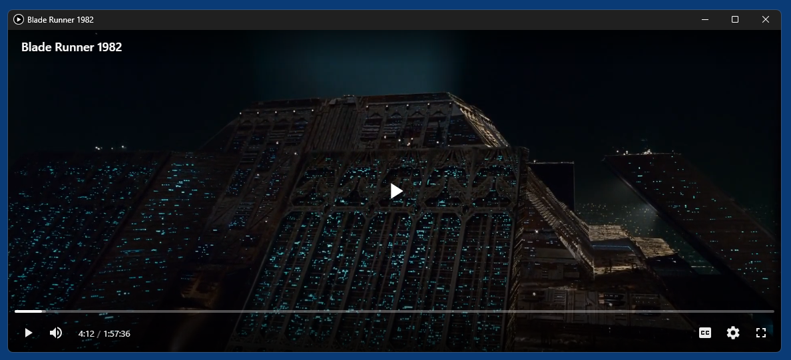

# vidfind

vidfind is a command line tool for Windows 11 that allows to find and play online movies via their [IMDb](https://en.wikipedia.org/wiki/IMDb)-ID.

It is based on [Microsoft Edge WebView2](https://developer.microsoft.com/en-us/microsoft-edge/webview2) and the `vidsrc` API and written in Python.

## Usage

```
Usage:

vidfind imdb-id [--play]
vidfind --query "some movie title"
```
By default the tool just prints the HLS master URL of the movie with the specified IMDb-ID to `STDOUT` and exits with exit code 0. If something went wrong - e.g. the IMDb-ID doesn't exist or there is no movie available for it - an error is printed to `STDERR` and the exit code is > 0. 

If you append the optional argument `--play`, vidfind instead plays the found video in a window.

If you don't know the IMDb-ID of a movie yet, you can use `--query "..."` to search for movies at IMDb by title. vidfind will print a list of the found results and exit.

### Examples

#### Find a movie and print its streaming URL: 
```cmd
vidfind tt0083658
```

#### Find a movie and play it directly with [VLC media player](https://www.videolan.org/):
```cmd
vidfind tt0083658 | "C:\Program Files\VideoLAN\VLC\vlc.exe" -
```

#### Find a movie and play it directly with [mpv](https://mpv.io/):
```
vidfind tt0083658 | D:\_portable\mpv\mpv.exe --playlist=-
```

#### Alternative that also works for players that don't accept filenames/URLs passed from `STDIN`:
```cmd
for /f %u in ('vidfind tt0083658') do @set "U=%u" && "C:\Program Files\VideoLAN\VLC\vlc.exe" "%U%"
for /f %u in ('vidfind tt0083658') do @set "U=%u" && D:\_portable\mpv\mpv.exe "%U%"
```

#### Save found URL in a temporary .m3u playlist file, then open this file with the default player for .m3u files: 
*As far as I can tell this the only way to automatically play the found streaming URL in [Windows Media Player (UWP)](https://en.wikipedia.org/wiki/Windows_Media_Player_(2022)), but this will only work if you previously associated .m3u files with it in the system settings.*
```cmd
vidfind tt0083658 > "%TMP%\tmp.m3u" && explorer "%TMP%\tmp.m3u"
```

#### Play a movie directly with vidfind:
```cmd
vidfind tt0083658 --play
```

Result:


#### Query movies in the IMDb database:
```
vidfind --query "blade runner"

tt0083658       "Blade Runner"          1982
tt1856101       "Blade Runner 2049"     2017
```

## Notes

- Finding a movie and extracting its streaming URL usually takes a couple of seconds. When vidfind is started for the very first time, it will take some extra seconds because a new local WebView2 profile has to be created as folder `profile` next to `vidfind.exe`. You can delete this `profile` folder any time.