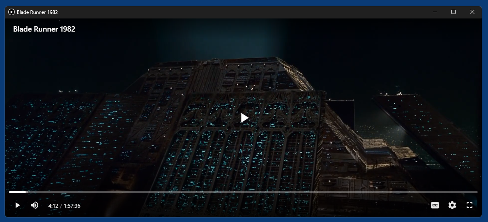

# vidfind

vidfind is a command line tool for Windows 11 that allows to find and play online movies.

It is based on [Microsoft Edge WebView2](https://developer.microsoft.com/en-us/microsoft-edge/webview2) and the `vidsrc` API and written in Python.

For Linux and macOS there is an [alternative version](vidfind-qt/) based on PyQt6 and QtWebEngine with basically the same interface, but without the `--play` argument, because QtWebEngine (unless self compiled) doesn't support .mp4 video with proprietary codecs like H.264.

## Usage

```
Usage:

vidfind --id <TMBD or IMDb ID> [--play]
vidfind "some movie title" [--play]
vidfind --query "some movie title"
```

Movies can either be identified by their [TMDB](https://www.themoviedb.org/) or [IMDb](https://www.imdb.com/) ID, or by a search string that contains the movie's title.

By default the tool just prints the HLS stream URL to `STDOUT` and exits with exit code 0. If something went wrong - e.g. the specified ID does not exist or there is no video available for it - an error is printed to `STDERR` and the exit code is > 0.

If you append the optional argument `--play`, vidfind instead plays the found video in a window.

Since movie titles are usually not unique, it's preferrable to specify a TMDB or IMDb ID. However, you can increase the chance that the first result is the correct one by appending the movie's year of release to the search string.

If the first argument is `--query "..."`, vidfind 

will print a list of the found results in the TMDB database and exit. Each result a line \<TMDB ID\> \<movie title\> \<year of release\>

### Examples

#### Find movie with specified TMDB ID and print its streaming URL: 
```
vidfind --id 78
```

#### Find movie with specified IMDb ID and print its streaming URL: 
```
vidfind --id tt0083658
```

#### Find movie with specified title (and optionally year) and print its streaming URL: 
```
vidfind "blade runner 1982"
```

#### Find movie and play it directly with [VLC media player](https://www.videolan.org/):
```
vidfind --id tt0083658 | "C:\Program Files\VideoLAN\VLC\vlc.exe" -
```

#### Find movie and play it directly with [mpv](https://mpv.io/):
```
vidfind --id tt0083658 | D:\_portable\mpv\mpv.exe --playlist=-
```

#### Find movie and play it directly with [MPC-HC](https://github.com/clsid2/mpc-hc):
*This method also works for other media players that don't accept filenames/URLs passed directly from `STDIN`*
```
for /f %u in ('vidfind --id tt0083658') do @set "U=%u" && call "C:\Program Files\MPC-HC\mpc-hc64.exe" "%U%"
```

#### Save found URL in a temporary .m3u playlist file, then open this file with the default player for .m3u files: 
*As far as I can tell this the only way to automatically play the found streaming URL in [Windows Media Player (UWP)](https://en.wikipedia.org/wiki/Windows_Media_Player_(2022)), but this will only work if you previously associated .m3u files with it in the system settings.*
```
vidfind --id tt0083658 > "%TMP%\tmp.m3u" && explorer "%TMP%\tmp.m3u"
```

#### Play movie directly with vidfind:
```
vidfind "blade runner 1982" --play
```

Result:


#### Find movie and download it with [yt-dlp](https://github.com/yt-dlp/yt-dlp) as .mp4 file:
```
vidfind --id tt0083658 | yt-dlp -o tt0083658.mp4 -a -
```

#### Find movie and download it with [JDownloader](https://jdownloader.org/home/index):
```
for /f %u in ('vidfind --id tt0083658') do @set "U=%u" && call "%LOCALAPPDATA%\JDownloader 2\JDownloader2.exe" "%U%"
```

#### Query movies in the TMDB database:
```
vidfind --query "blade runner"

335984          "Blade Runner 2049"     2017
78              "Blade Runner"          1982
...
```

## Notes

- Finding a movie and extracting its streaming URL usually takes a couple of seconds. When vidfind is started for the very first time, it will take some extra seconds because a new local WebView2 profile has to be created as folder `profile` next to `vidfind.exe`. You can delete this `profile` folder any time.